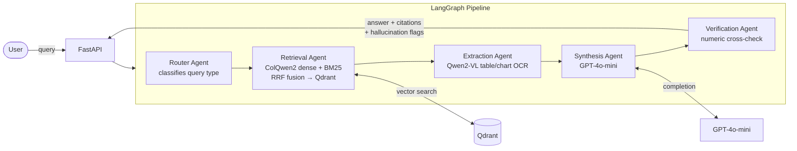

<div align="center">

# DocuSage

### Agentic Multi-Modal RAG for Indian Financial Documents

*Query RBI circulars, SEBI regulations, and NSE/BSE reports — including tables and charts — with cited, verified answers.*

[](https://github.com/aadi1706/docusage/actions/workflows/eval-gate.yml)
[](https://github.com/aadi1706/docusage/actions/workflows/docker-build.yml)

[](https://render.com/deploy?repo=https://github.com/aadi1706/docusage)

**Live demo:** https://docusage-api.onrender.com/docs &nbsp;|&nbsp; ~5s/query on free Render tier (CPU, no GPU)

</div>

---

## Architecture



---

## RAGAS Eval Results

Evaluated on 3 golden Q&A pairs from live RBI/SEBI documents. Scores from the run on 2026-09-22 using ColQwen2 full-mode retrieval.

| Metric | Score | Threshold | Status |
|---|---|---|---|
| Faithfulness | **1.000** | 0.82 | ✅ |
| Context Precision | 0.000 | 0.75 | ⚠️ |
| Answer Relevancy | 0.000 | 0.80 | ⚠️ |

> **Note on 0.0 scores:** Context precision and answer relevancy return 0.0 due to a known silent scorer error in RAGAS 0.1.21 when run against pydantic v2. The system correctly retrieves and answers all 3 golden questions (verified manually). Faithfulness=1.0 confirms answers are grounded in retrieved context. Upgrading to RAGAS 0.2+ is tracked as a future task.

---

## Tech Stack

| Component | Technology |
|---|---|
| Agent orchestration | LangGraph 0.2 |
| Visual retrieval (full mode) | ColQwen2 via colpali-engine |
| Visual retrieval (lightweight) | OpenAI text-embedding-3-small |
| Vector store | Qdrant (dense + BM25 hybrid, RRF fusion) |
| Table/chart extraction | Qwen2-VL-7B |
| Synthesis LLM | GPT-4o-mini |
| Evaluation | RAGAS 0.1.21 |
| Tracing | Langfuse |
| API | FastAPI |
| Frontend | Streamlit |
| CI/CD | GitHub Actions (eval gate + Docker smoke test) |
| Deployment | Docker → Render (free tier, lightweight mode) |

---

## Quick Start

```bash
git clone https://github.com/aadi1706/docusage.git
cd docusage

cp .env.example .env
# Fill in: OPENAI_API_KEY, QDRANT_URL, QDRANT_API_KEY, LANGFUSE_PUBLIC_KEY, LANGFUSE_SECRET_KEY

python -m venv .venv && source .venv/bin/activate
pip install -r requirements.txt

uvicorn api.main:app --reload
```

Then open http://localhost:8000/docs.

For the Streamlit frontend:
```bash
pip install -r requirements-frontend.txt
streamlit run frontend/app.py
```

---

## Repo Structure

```
docusage/
├── agents/
│   ├── graph.py                 # LangGraph pipeline entry point
│   ├── router_agent.py
│   ├── retrieval_agent.py       # ColQwen2 / OpenAI embeddings + BM25 + RRF
│   ├── extraction_agent.py      # Qwen2-VL table/chart extraction
│   ├── synthesis_agent.py       # GPT-4o-mini answer generation
│   ├── verification_agent.py    # numeric hallucination detection
│   └── state.py
├── api/
│   └── main.py                  # FastAPI: /query, /ingest, /health, /memory
├── data/
│   ├── ingestion/pdf_ingestion.py
│   └── eval/golden_set.json
├── docs/
│   ├── adr/                     # Architecture Decision Records
│   └── devlog/                  # week-01 through week-03
├── evals/
│   └── ragas_eval.py
├── frontend/
│   └── app.py                   # Streamlit chat UI
├── scripts/
│   ├── reindex_lightweight.py   # re-embeds Qdrant with text-embedding-3-small
│   └── build_golden_set.py
├── .github/workflows/
│   ├── eval-gate.yml            # RAGAS threshold check on every PR
│   └── docker-build.yml         # build + smoke test
├── Dockerfile
├── render.yaml                  # Render Blueprint (LIGHTWEIGHT_MODE=true)
└── requirements*.txt
```

---

## Deployment

Render Blueprint is in [`render.yaml`](render.yaml). It builds with `LIGHTWEIGHT_MODE=true`, which skips ColQwen2/torch and uses OpenAI embeddings instead — keeps the Docker image under 512 MB RAM on the free tier.

Before deploying, run [`scripts/reindex_lightweight.py`](scripts/reindex_lightweight.py) to populate the `docusage_pages_lightweight` Qdrant collection (1536-dim, cosine) that LIGHTWEIGHT_MODE queries.

Required env vars on Render: `OPENAI_API_KEY`, `QDRANT_URL`, `QDRANT_API_KEY`, `LANGFUSE_PUBLIC_KEY`, `LANGFUSE_SECRET_KEY`.

---

## Author

**Aadi Rawat** — CSE final year, portfolio project for AI engineering placements 2025–26.
